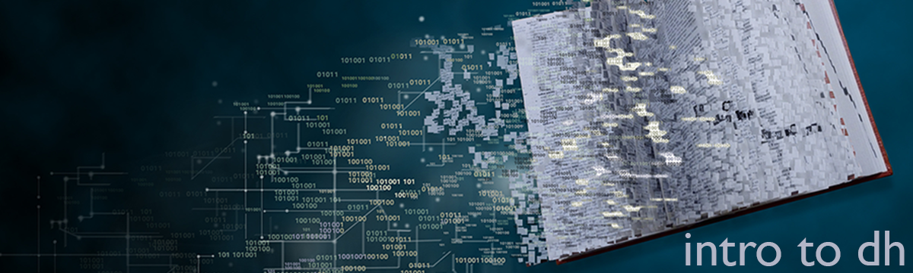

# About
This course is a hands-on introduction to the history, theory, and practice of the [digital humanities](assets/dh_papers.png). In the humanities, we study how cultural context shapes how we create, understand, and interact with artifacts and systems. The digital in digital humanities signals two primary shifts in this framework: (1) attention to how cultural context shapes how we create, understand, and interact with digital artifacts and digital systems, and (2) digital inquiry into how cultural context shapes how we create, understand, and interact with artifacts and systems. This course engages both modes through a study of the digital humanities in its critical, archival, empirical, interventional, and experimental variants. The readings and assignments are designed to help students learn to evaluate the nature of digital humanities artifacts, projects, and scholarship through project-based exercises in creating and interpreting digital humanities resources, and a close (and critical) look at the infrastructural, institutional, and political issues involved in digital creation, analysis, dissemination, and preservation. As we look at the concepts, methods, and theories of digital humanities through the perspective of practice, we will not only consider how computational methods are being used to further humanities research and teaching but how the humanities can deepen our understanding of computational methods and infrastructures.

# Assignments 
* DH Technology Demonstration (20%)
* [The Octopus Assignment](assets/Octopus_Assignment.pdf)
  - Annotated bibliography (20%)
  - Project Proposal (20%)
  - DH Project (20%) 

# Texts
Course readings will include \*[Data Feminism](https://mitpressonpubpub.mitpress.mit.edu/data-feminism), Catherine D’Ignazio and Lauren F. Klien; \*[Debates in the Digital Humanities 2019](https://dhdebates.gc.cuny.edu/projects/debates-in-the-digital-humanities-2019), Matthew K. Gold and Lauren F. Klien (Eds.); Distant Horizons, Ted Underwood; Race After Technology, Ruha Benjamin; Rhetoric and the Digital Humanities, Jim Ridolfo & Bill Hart-Davidson (Eds.); \*[Supervised Machine Learning for Text Analysis](https://smltar.com/) in R, Emil Hvitfeldt and Julia Silge; \*[Text Mining with R: A Tidy Approach](https://www.tidytextmining.com/), Julia Silge and David Robinson and additional article-length readings provided on Canvas. Free open access versions are available for texts marked with an asterisk. Other books are available at the [University Coop](https://www.universitycoop.com/adoption-search), and supplemental readings and practical modules ("How") are available on [Canvas](https://canvas.utexas.edu/). 

# Syllabus
|WHEN |	WHAT |	WHY |	HOW |
|:--|:---|:------|:----|
|1.19 |	DH tapas | Noble, Toward a Critical Black DH (DHD) Ridolfo & Hart-Davidson, Intro (RDH) Warren et al., Six Degrees of F. Bacon Arnold & Tilton, New Data (DHD) Mul & Masson, Data-based Art | |
|1.26 |	DH Discontents |	Allington, Brouillette, Golumbia, Neoliberal   Roh, The DH Bubble (DHD)  Long & Baker, The Elusive (DHD) |	Get ‘R Started |
|2.2 |	Critical | DH	Benjamin, Race After Technology |	Git Connected |
|2.9 |	Critical DH |	Brown, Crossing State (RDH)  Sano-Franchini, Cultural Rhetorics (RDH)  Hicks, Sexism is a Feature | Data Wrangling|
|2.16 |	Archival DH  [Feat. Lars Hinrichs](https://liberalarts.utexas.edu/english/faculty/profile.php?eid=lh9896)	| Sherratt, Unremembering   Ward & Wisnicki, The Archive (DHD)  Smiley, From Humanities to (DHD)   Eyeman & Ball, DH Scholarship (RDH) |	Text Analytics |
|2.23 |	I can haz \$\$? |	NEH DH Advancement   NEH Digital Projects for the Public   FIC Undergraduate Teaching Grant |	**Lit Review Due** |
|3.2 |Empirical DH |	Manovich, The Science of Culture   Graham, The Science of Intuition ||
|3.9 |Empirical DH |	Underwood, Distant Horizons	||
|3.16 |	SPRING BREAK | SPRING BREAK | SPRING BREAK |
|3.23 |	Empirical DH |Graham, Moral Medicine  Majdik, A Computational Approach Rawson & Muñoz, Against Cleaning (DHD)|	Framegrams  **Proposal Due**|
|3.30 |	Empirical DH |	Hsieh & Shannon, Three Approaches  de Sá Pereira, Mixed Methods (DHD) Luhmann & Burghardt, Digital Humanities|	Content Analysis |
|4.6 |Interventional DH| D’Ignazio & Klien, Data Feminism	||
|4.13 |Interventional DH|	Williams, Share it & Data as Public Good Graham & Hopkins, AI for Social Justice|	Feature Engineering|
|4.20	|Interventional DH|	Rice & Rice, Pop-Up Archives Breast Pump Hackathon Missing Migrants|ML Modeling|
|4.27	|Experimental DH [Feat.: Casey Boyle](http://caseyboyle.net/)|Binder et al., Stochastic Parrots Underwood, Mapping Kishi, et al |Generative Sandboxes|
|5.4	|Tech Demos|Tech Demos|**Tech Demos**|
|5.11	|Finals Week|	Finals Week|**Project Due**|

# Acknowledgements 
* The "Octopus Assignment" is adapted from Dr. Courtney Thompson's [Choose Your Own Adventure Assignment](https://twitter.com/Dr_C_Thompson/status/1333492508677058561?s=20).
